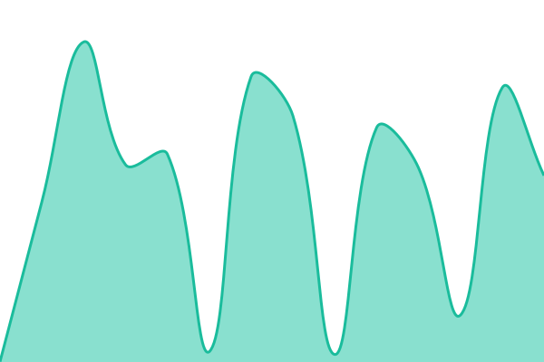
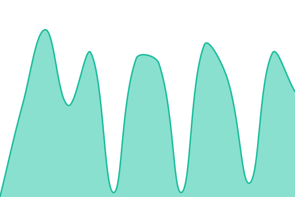

# [📈 Live Status](https://status.jenlihai.website): <!--live status--> **所有服務正常**

This repository contains the open-source uptime monitor and status page for [PoYu](https://jerrytech.vercel.app/), powered by [Upptime](https://github.com/upptime/upptime).

With [Upptime](https://upptime.js.org), you can get your own unlimited and free uptime monitor and status page, powered entirely by a GitHub repository. We use [Issues](https://github.com/jerryhuangyu/lihaiplan-status/issues) as incident reports, [Actions](https://github.com/jerryhuangyu/lihaiplan-status/actions) as uptime monitors, and [Pages](https://status.jenlihai.website) for the status page.

<!--start: status pages-->
<!-- This summary is generated by Upptime (https://github.com/upptime/upptime) -->
<!-- Do not edit this manually, your changes will be overwritten -->
<!-- prettier-ignore -->
| URL | Status | History | Response Time | Uptime |
| --- | ------ | ------- | ------------- | ------ |
|  [drafts.jenlihai.website · 開啟計畫連結](https://drafts.jenlihai.website/d/5c5fg2jasp2h) | 正常 | [讀取一份真實計畫.yml](https://github.com/jerryhuangyu/lihaiplan-status/commits/HEAD/history/讀取一份真實計畫.yml) | 

 3456毫秒
     
 | 

<a href="https://status.jenlihai.website/history/讀取一份真實計畫">98.64%</a>
    

|  [plan.jenlihai.website · 儀表板與 API](https://plan.jenlihai.website/healthz) | 正常 | [api.yml](https://github.com/jerryhuangyu/lihaiplan-status/commits/HEAD/history/api.yml) | 

 619毫秒
     
 | 

<a href="https://status.jenlihai.website/history/api">99.15%</a>
    

|  [auth.jenlihai.website · 登入](https://auth.jenlihai.website/healthz) | 正常 | [登入.yml](https://github.com/jerryhuangyu/lihaiplan-status/commits/HEAD/history/登入.yml) | 

 656毫秒
     
 | 

<a href="https://status.jenlihai.website/history/登入">99.15%</a>
    

<!--end: status pages-->

[**Visit our status website →**](https://status.jenlihai.website)

## 📄 License

- Powered by: [Upptime](https://github.com/upptime/upptime)
- Code: [MIT](./LICENSE) © [Anand Chowdhary](https://anandchowdhary.com)
- Data in the `./history` directory: [Open Database License](https://opendatacommons.org/licenses/odbl/1-0/)
